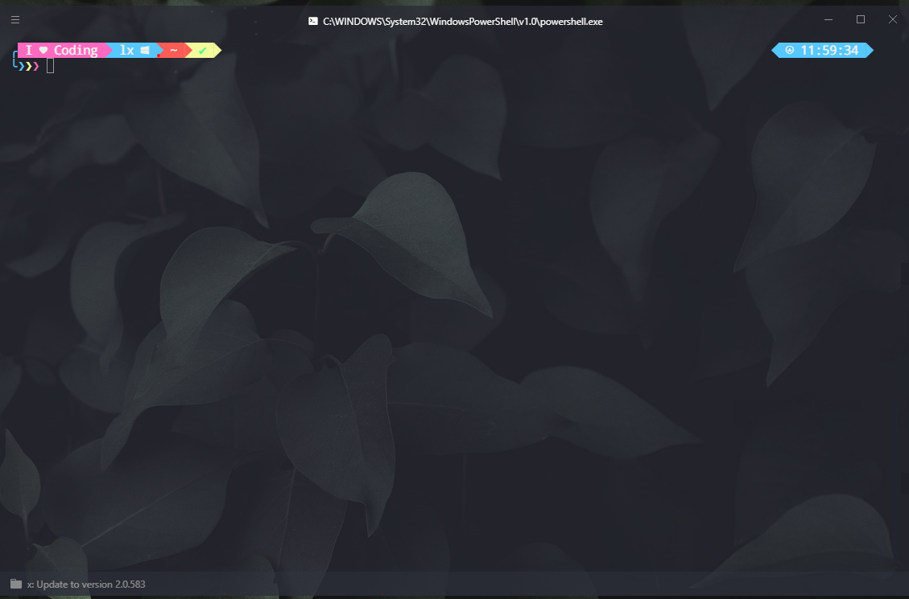
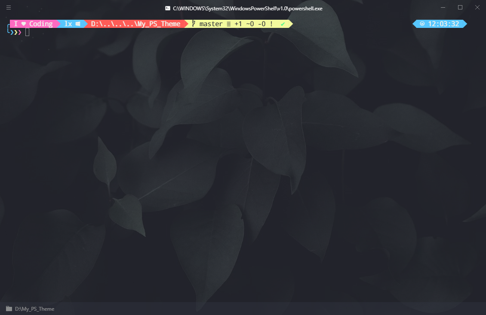

# My_PS_Theme

 A Colorful PS Terminal Theme.


1.仅支持PowerShell与Windows10平台.

2.需要
[oh-my-posh](https://github.com/JanDeDobbeleer/oh-my-posh)
与
[Nerd Font](https://github.com/ryanoasis/nerd-fonts)
支持.

3.支持用户名,路径,操作系统(除了Windows10也没有其他可能了哇),上条命令执行情况,执行时间等显示.

4.对git提供支持.

5.需使用第三方终端，如

[Hyper]:https://github.com/zeit/hyper


## ScreenShots






[^透明]:PS:透明度特性由Hyper提供，请自行启用如Hyper-Transparent-Dynamic插件

## Installation

1.确保已安装并启用oh-my-posh及所需依赖。

2.安装Nerd Font，截图所示为"
[DroidSansMono]:https://github.com/ryanoasis/nerd-fonts/releases/download/v2.0.0/DroidSansMono.zip
"字体，请下载安装后在终端中设置字体为"DroidSansMono Nerd Font Mono"

3.将项目中"LoveCoding.psm1"下载放入“文档\WindowsPowerShell\Modules\oh-my-posh\\(XXXX)\Themes”目录，并在PowerShell Profile文件中启用

```bash
Import-Module posh-git
Import-Module oh-my-posh
Set-Theme LoveCoding
```

4.初次执行请以管理员权限运行以信任文件

```bash
Unblock-File “Path/to/LoveCoding.psm1"
```

5.若出现字体无法显示请运行

```
chcp 437
chcp 65001
```

